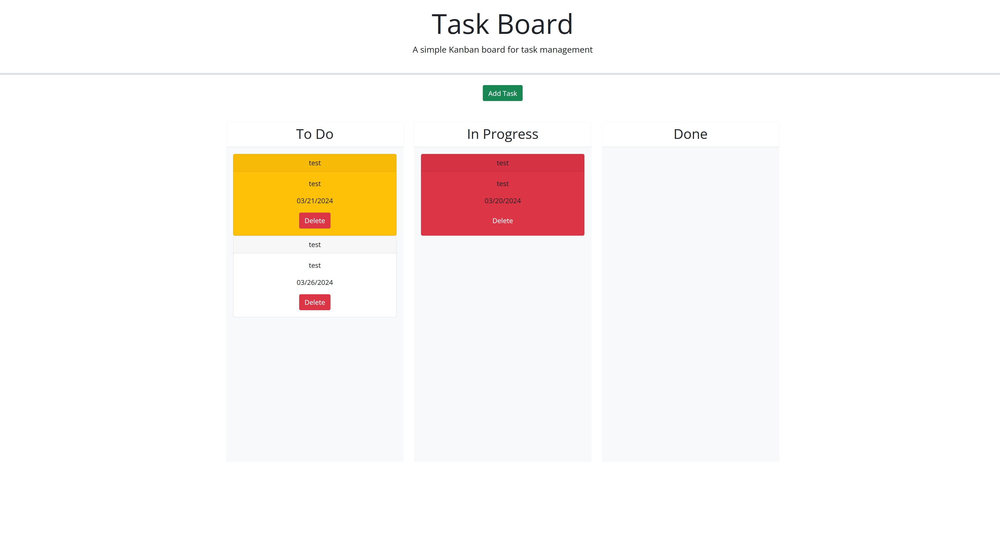

# 05 Third Party APIs - Task Manager Website

## Description
A website which allows the user to create tasks with a title, description and due date. The tasks can be moved around based on their completion status, and removed when completed.
## Links
[GitHub Repository](https://github.com/zwanner/05-Project-Task-Tracker)

[Live Demo](https://zwanner.github.io/05-Project-Task-Tracker)
## Screenshot

